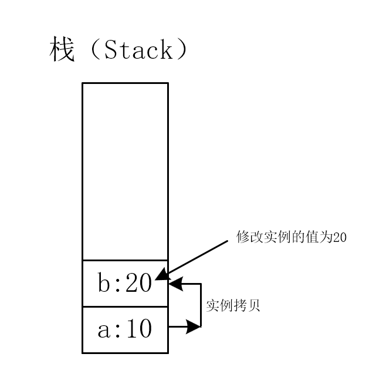

# C# 类型系统

## C# 类型概述

C# 作为一门静态强类型语言，每个变量和常量都应该有各自的类型，每个求值的表达式也有类型。C# 主要采用的是规范类型系统。规范类型系统使用名称来标识每一种类型，例如：`struct`、`class` 和 `interface`，甚至是 `record` 类型，都是通过其名称来标识的。

## C# 的类型类别

C# 的类型被分为了两大类：
1. 值类型（Value Type）
2. 引用类型（Reference Type）

## 值类型

### 概述

值类型直接存储变量的实例，通常分配在栈上。继承自 `System.ValueType`（而 `System.ValueType` 又继承自 `System.Object`）

### 特点

由于值类型是直接在栈上存储变量的实例，所以在赋值、方法传参和作为方法的返回值时默认是采用的实例拷贝的方式。即把整个变量的实例复制给被赋值的变量。

::: code-group

```cs [C#]
int a = 10;
int b = a; // 变量a将实例拷贝进了变量b里
b = 20; // 变量b的实例来自变量a的拷贝，所以修改变量b的值并不会影响变量a的值
```

:::

**内存结构图：**



> [!TIP] 提示
> 值类型在声明时，也不一定是存储在栈上的，值类型实际的存储位置是根据当前所属的对象的类型决定的。
>
> 如果是声明局部变量，那么这个变量就一定是存储在栈上的。
>
> 如果是在一个引用类型中声明的值类型的变量，那么这个值类型的变量就是存储在堆中的。

## 引用类型

### 概述

定义为 `class` 、 `record class` 、 `record` 、 `delegate` 、数组或 `interface` 的类型属于 `reference type` 。

当声明一个 `reference type` 类型的变量时，该变量将包含值 `null` ，直到为其分配该类型的实例或使用 `new` 运算符创建一个实例。以下示例演示了类的创建和赋值：

::: code-group

```cs [C#]
Person p1 = new Person();
Person p2 = p1;
```
:::

### 特点

引用类型之所以叫引用类型，就是因为它在栈上并不直接存储实例，而是将实例存储在了堆中，栈中存储了指向堆中实例的引用。在赋值时，引用类型只会复制引用至被赋值对象，所以这就造成了引用类型与值类型不同的赋值行为。

::: code-group

```cs [C#]
Person p1 = new Person();
Person p2 = p1; // 由于Person类是引用类型，所以p2只是复制了p1的引用
p2.name = "John"
Console.WriteLine(p1.name); // 输出 "John"
```
:::

两个变量的引用相同，那么它们就指向了堆中同一块内存区域，这时候修改任意一方都会影响另一方。

**内存结构图：**


> [!TIP] 提示
> 引用类型的引用存储也不一定是在栈上，它的存储位置取决于是声明局部变量，还是在引用类型中声明。
>
> 如果是声明局部变量，那么引用就是存储在栈中。
>
> 如果是在一个引用类型，例如某个类中声明的类字段，那么这个引用类型的字段就是将引用存储在堆中，实例同样存储在堆中。

## 特殊存储时的内存结构图

### 值类型声明在引用类型中

**内存结构图：**

可以很明显的看到，值类型在引用类型中声明时，它的实例与值都是存储在了堆中。


其余的特殊情况如上面的提示所述，这里就不多赘述了。