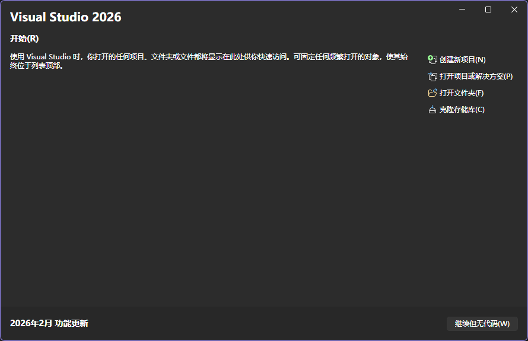
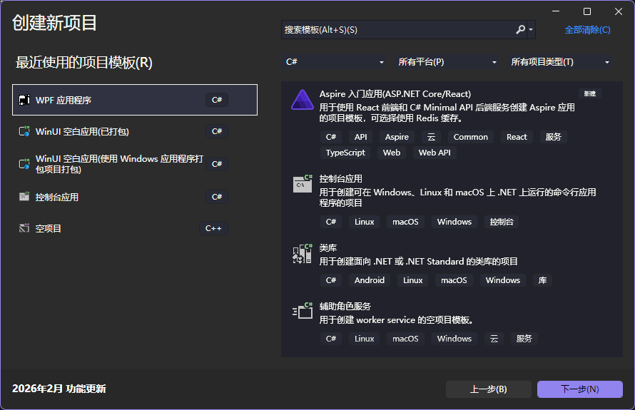
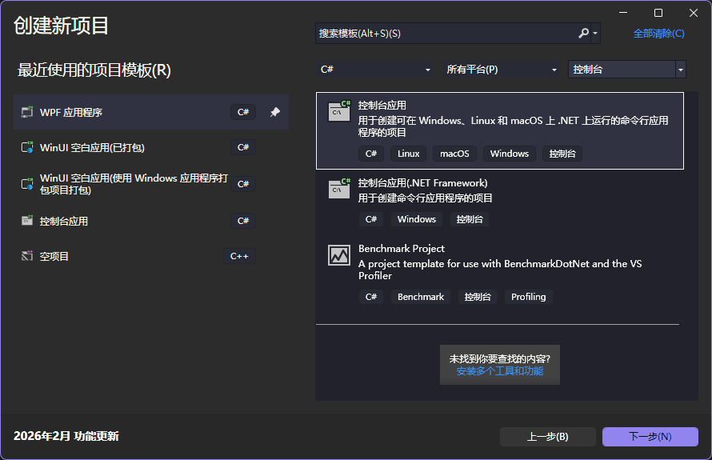
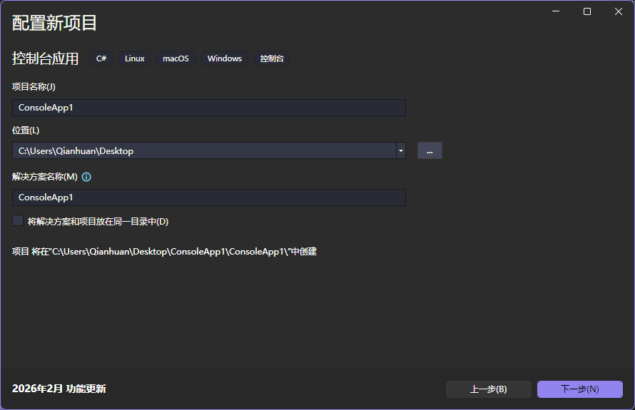

## 流水的语言，铁打的HelloWorld（创建第一个项目）

打开安装好的 Visual Studio，如果没有安装的请前往[开发环境搭建](./开发环境搭建.md)去安装。

打开 Visual Studio，可以看到这样的启动界面（有可能是英文，请自行查阅如何切换语言），然后点击 `创建新项目(N)` 。

## 创建新项目

之后就会进入如下界面：

可以选择一下语言为 C#，项目类型为控制台应用。

注意：请点击 `控制台应用` 而不是点击 `控制台应用(.NET Framework)`

## 创建控制台应用

然后点击下一步，进入到项目配置界面。

## 配置项目
<!-- Configure Project -->

这里就不过多赘述了，都是字面意思。

## 项目信息

第一个就是选择使用的 .NET 版本，这里选择 `最新版本` 即可。

第二个就是是否使用 `顶级语句` 这里勾选上才是 `不使用`，这里可以勾选上，不需要 `顶级语句`。

第三个是是否启用原生 AOT 发布，这里不需要勾选，学习 C# 时不需要使用 AOT。

最后点击创建，项目就创建成功了！那一刻仿佛冯诺依曼在向你招手，图灵在向你微笑，编程万岁，开源万岁！！！

## 参考文献

[BiliBili视频教程](https://www.bilibili.com/video/BV1s1z6BHEfV?p=4)

**很推荐关注这个up主**